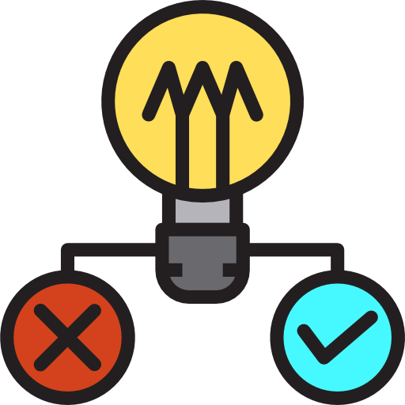

<p align="center">
  
</p>

<h1 align="center">Would You Rather ?</h1>

<p align="center">Would you rather select this or that ?</p>


A web application that lets users propose questions, which other users can then answer. This app was made with react and it's learning goal was to learn Redux.

## Clone
``` bash
git clone https://github.com/DipanshKhandelwal/would-you-rather.git
cd would-you-rather
```

## Run
``` bash
npm install
npm start
```

# DATA
Refer about the [_DATA.js](./src/utils/_DATA.js) file [here](./src/utils/DATABASE.md).

<div>Icons made by <a href="https://www.flaticon.com/authors/payungkead" title="Payungkead">Payungkead</a> from <a href="https://www.flaticon.com/" 			    title="Flaticon">www.flaticon.com</a> is licensed by <a href="http://creativecommons.org/licenses/by/3.0/" 			    title="Creative Commons BY 3.0" target="_blank">CC 3.0 BY</a></div>